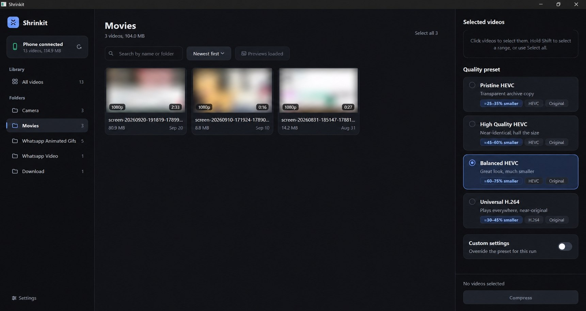
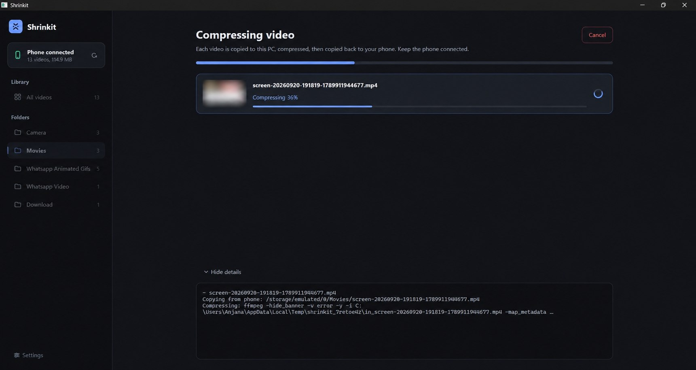

# Shrinkit

Browse videos on your Android phone by folder, compress them with ffmpeg (HEVC-first presets), and push the smaller file back to the phone. Originals on the phone are never touched — the compressed copy is saved alongside as a new file.

## Download

Every push builds a Windows `Shrinkit.exe` under **GitHub Releases** (tag `build-N`). The exe still needs **ADB** and **ffmpeg + ffprobe** installed and in `PATH` — those are external tools, not bundled.

## Screenshots




## Requirements

- Python 3.10+ with `pip install -r requirements.txt` (PyQt6)
- **ADB** ([Android platform-tools](https://developer.android.com/tools/releases/platform-tools)) in `PATH`, USB debugging enabled on the phone
- **ffmpeg + ffprobe** ([ffmpeg.org](https://ffmpeg.org/download.html)) in `PATH`

Shrinkit shows a banner on startup if ADB or ffmpeg is missing.

## Run

```bash
pip install -r requirements.txt
python main.py
```

1. Connect the phone over USB, accept the RSA prompt on the phone.
2. Click **Refresh** — videos are grouped by phone folder (Camera, Movies, WhatsApp Video, …).
3. Search, sort (Newest / Largest / Longest / Name), and load previews per video (↻) or per folder (**Load previews**).
4. Select a video → **Continue** → pick a preset → **Compress**.
5. Watch pull → compress → push steps with a live progress bar and log. The result page shows before/after sizes.

## Presets (`presets.py`)

| Preset | Codec | CRF | Resolution | Audio | Typical saving |
|---|---|---|---|---|---|
| Pristine HEVC | HEVC `slow` | 18 | Original | 192k | ≈25–35% smaller |
| High Quality HEVC *(default)* | HEVC `slow` | 21 | Original | 160k | ≈45–60% smaller |
| Balanced HEVC | HEVC `medium` | 24 | Original | 128k | ≈60–75% smaller |
| Universal H.264 | H.264 `slow` | 19 | Original | 160k | ≈30–45% smaller |

**Advanced overrides** (optional checkbox): CRF slider 16–28, resolution cap (Original / 1440p / 1080p / 720p max, Lanczos, never upscales), audio bitrate, or drop audio entirely.

Notes:

- HEVC outputs are tagged `hvc1` so iPhone / QuickTime / Android galleries recognise them.
- Metadata is carried over (`-map_metadata 0`) and MP4s get `+faststart` for instant playback.
- Slow encodes on 4K take a while — the progress bar moves slowly but truthfully.

## Project layout

| File | Role |
|---|---|
| `main.py` | PyQt6 UI — 5 pages (folders → videos → preset → progress → done), theme, navigation |
| `adb.py` | ADB wrapper — single USB device, MediaStore discovery, pull/push, grouping by folder |
| `ffmpeg.py` | `build_command` (preset → ffmpeg args), ffprobe duration, single-frame extraction |
| `workers.py` | Background threads — video loading, pull → compress → push pipeline with live `%` parsing |
| `presets.py` | The 4-preset lineup and defaults |
| `thumbs.py` / `cache.py` | Lazy thumbnail extraction + on-disk thumbnail cache |

Logs rotate in the OS app-data dir (`Shrinkit/logs`, viewable via **Settings → Open logs folder**); the thumbnail cache can be cleared from the same dialog. Temp files on the PC are deleted after every run, success or cancel.
